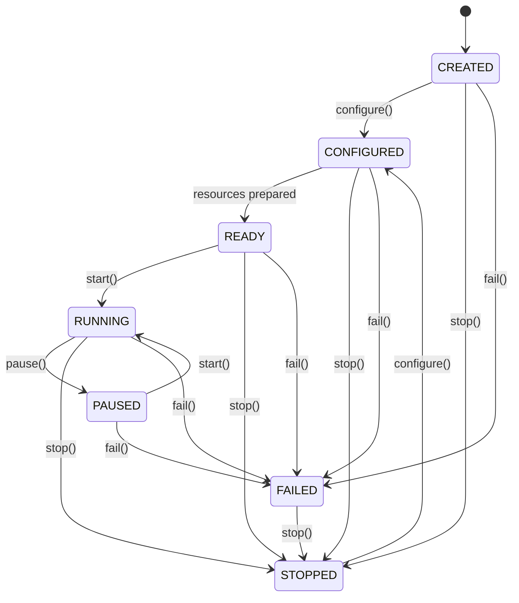
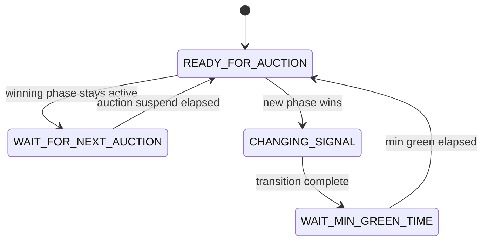
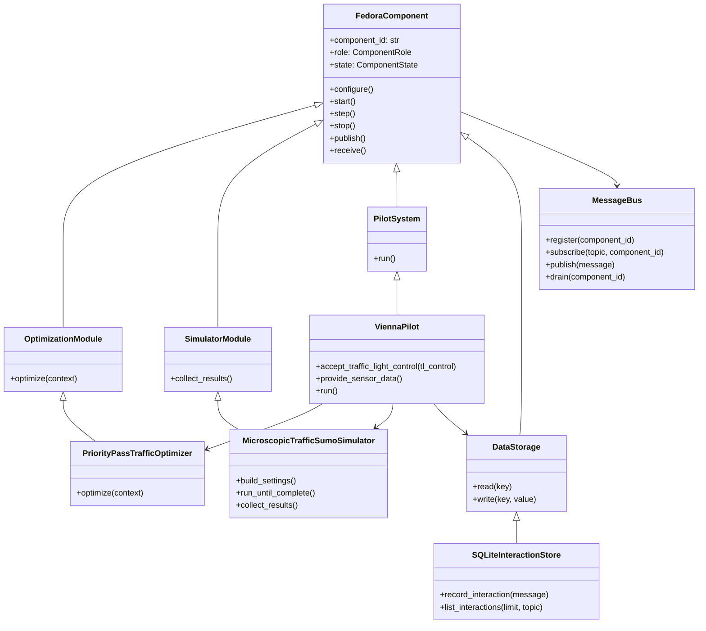
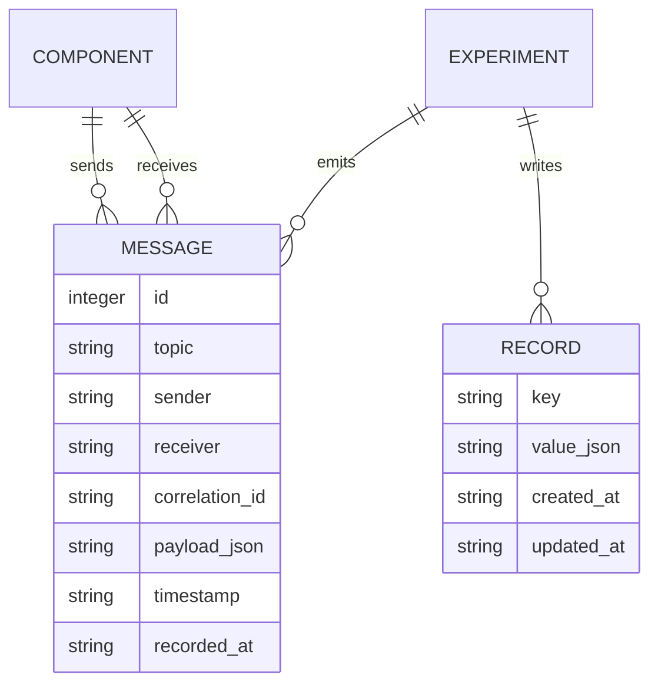
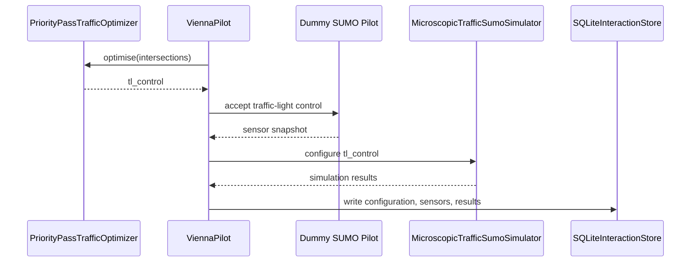

<p align="center">
  
</p>

# FEDORA Platform

FEDORA is a European research and innovation project for next-generation
multimodal traffic management. The project develops Mobility and Transport
Multimodal (MTM) Spaces: federated digital ecosystems where public authorities,
transport operators, industry, researchers, and citizens can cooperate through
secure data sharing and advanced digital tools.

This repository provides a reusable Python platform for FEDORA pilots. It is
designed around finite-state components for optimisation modules, simulators,
pilot systems, data storage, and communication systems. Pilot-specific assets
live in `models/`, so the repository is self-contained.

## Pilots

<table>
  <tr>
    <td width="33%" valign="top">
      <br>
      <b>Pilot 1 - Vienna, Austria</b><br>
      Multimodal services optimisation for equitable future mobility.
    </td>
    <td width="33%" valign="top">
      <br>
      <b>Pilot 2 - Basque Country, Spain</b><br>
      Focus: freight logistics hub integration.
    </td>
    <td width="33%" valign="top">
      <br>
      <b>Pilot 3 - Nicosia, Cyprus</b><br>
      Focus: integration of aerial and road traffic services.
    </td>
  </tr>
  <tr>
    <td width="33%" valign="top">
      <br>
      <b>Pilot 4 - Copenhagen, Denmark</b><br>
      Focus: foresight simulations for future mobility.
    </td>
    <td width="33%" valign="top">
      <br>
      <b>Pilot 5 - Reggio Emilia, Italy</b><br>
      Focus: demand management strategies.
    </td>
    <td width="33%" valign="top">
      <br>
      <b>Pilot 6 - Budapest, Hungary</b><br>
      Focus: cross-modal management of road and inland waterways.
    </td>
  </tr>
</table>

## Vienna Pilot

The Vienna pilot focuses on optimising multimodal traffic management services to
support equitable and socially balanced urban mobility in the city centre.

Building on the C-ITS infrastructure deployed by the City of Vienna since 2020,
the pilot extends traffic management beyond private car traffic to include
pedestrians, cyclists, and public transport. Along the Ringstrasse and both
sides of the Danube Canal, traffic lights are equipped with infrastructure-based
C-ITS units providing services such as Green Light Optimal Speed Advice, signal
phase and timing information, and the Green Wave Vienna App. These solutions
enable dynamic green time optimisation based on local traffic conditions and are
applied across a broader range of transport modes than before.

The pilot area covers key sections of Vienna's primary urban road network,
including tram corridors with mixed and dedicated traffic, bus lanes, and
segregated cycling facilities. Up to 15 signalised intersections are used for
testing and demonstration, complemented by the Mega Bicycle Highway along
Praterstrasse, which supports cyclist participation through FEDORA's mobile
application. Traffic management is supported by an expanded monitoring system
combining C-ITS and V2X data, floating car data, stationary detectors, and
traffic signal data, feeding near real-time multimodal traffic models. Within
FEDORA, Vienna applies social optimum models and tests synchromodal
optimisation algorithms in a real urban environment, supporting network-wide
impact assessment and future mobility planning.

Key elements:

- C-ITS-equipped traffic lights
- Multimodal traffic management
- Social optimum optimisation models
- Integration of pedestrians, cyclists, and public transport
- Green Light Optimal Speed Advice and Green Wave Vienna App
- V2X and C-ITS data from cars, trams, and buses
- Webcam-based and stationary traffic detection
- Real-time road traffic models
- Multimodal traffic modelling for Eastern Austria
- Simulation and foresight analysis tools

The current executable prototype for this pilot is the Priority Pass traffic
signal optimiser:

- `PriorityPassTrafficOptimizer` creates traffic-light control settings.
- `MicroscopicTrafficSumoSimulator` runs the SUMO microscopic traffic model.
- `ViennaPilot` represents the pilot side, accepts traffic-light control plans,
  and provides dummy sensor snapshots from a second SUMO-backed field model.

## Repository Structure

```text
src/fedora_platform/
  components.py      Abstract FEDORA components and finite-state lifecycle
  communication.py   Message bus plus transport adapter templates
  storage.py         Memory, JSON, and SQLite stores plus storage templates
  mtm_space.py       Component container for one MTM Space
  priority_pass.py   Vienna Priority Pass implementation
  traffic_model_sumo/
                     SUMO controller, recorder, and microscopic simulator code

models/
  pilot_vienna/
    sumo/                SUMO network, demand, route and phase files
  pilot_basque_country/
  pilot_nicosia/
  pilot_copenhagen/
  pilot_reggio_emilia/
  pilot_budapest/

figures/
  Pilot images and repository banner

example/
  run_priority_pass.py
```

## Component Model

The platform separates five responsibilities:

- `OptimizationModule`: computes control or planning decisions.
- `SimulatorModule`: runs a digital model and exposes simulation results.
- `PilotSystem`: represents the field side of a pilot, real or simulated.
- `DataStorage`: persists records, results, and interaction logs.
- `MessageBus`: moves typed `Message` objects between components.

Every component is a finite state machine with the same lifecycle. This makes it
possible to compose optimisers, simulators, storage backends, and pilots without
each class inventing its own readiness semantics.



The Priority Pass controller inside SUMO is also an FSM. It repeatedly auctions
traffic-light phases, changes signal state when needed, enforces a minimum green
period, and waits before the next auction. These states are exposed in
`PriorityPassControllerState` and `PRIORITY_PASS_CONTROLLER_TRANSITIONS` in
`src/fedora_platform/priority_pass.py`.



## Class Diagram



## Entity Relationship Model

The local SQLite store can keep both experiment records and a full interaction
log of all messages published through the in-memory bus.



## Vienna Pilot Message Flow



## Communication Templates

`available_communication_templates()` provides a catalog for future adapters:

| Template | Good for | Notes |
| --- | --- | --- |
| TCP | Reliable component streams in a trusted network | Newline-delimited JSON messages over sockets |
| UDP | High-frequency sensor telemetry | Add sequence numbers and timestamps |
| REST API | Service and dashboard integration | Simple request-response HTTP |
| SOAP API | Legacy authority or enterprise systems | WSDL/XML contract style |
| WebSocket API | Live bidirectional pilot and dashboard links | Good for sensor/control loops |
| Blockchain | Audit, settlement, and trust anchors | Store commitments and hashes, not raw telemetry |

The current runnable implementation is `InMemoryMessageBus`, which is enough for
local tests and can optionally log every published message to SQLite.

## Data Storage

Available storage implementations:

- `InMemoryDataStore`: volatile records for tests.
- `JSONFileDataStore`: one JSON file per logical key.
- `SQLiteInteractionStore`: local database using Python's built-in `sqlite3`.

`SQLiteInteractionStore` is the practical local default: it requires no database
server, stores key-value records, and records every message interaction when
attached to `InMemoryMessageBus`.

Additional templates in `available_storage_templates()` describe likely next
steps: DuckDB for analytics, PostgreSQL/PostGIS for operational pilots, and
S3-compatible object storage for large simulation outputs.

## Diagram Tooling

The README uses Mermaid, which renders directly on GitHub and works well for
FSMs, class diagrams, ER diagrams, and sequence diagrams.

Useful packages if generated figures are needed later:

- `transitions[diagrams]`: Python FSM package that can export Graphviz diagrams.
- `graphviz`: mature DOT-based diagram rendering.
- `plantuml`: good for large architecture diagrams in documentation pipelines.
- `mermaid-cli`: renders Mermaid diagrams to SVG/PNG in CI.

## Running

Dry-run the Vienna Priority Pass configuration without starting SUMO:

```bash
python example/run_priority_pass.py
```

Run the full simulation when SUMO is installed:

```bash
python example/run_priority_pass.py --run --sumo-binary sumo
```

On Windows, pass the executable path if it is not on `PATH`:

```bash
python example/run_priority_pass.py --run --sumo-binary C:\path\to\sumo.exe
```

Use a specific local SQLite interaction log:

```bash
python example/run_priority_pass.py --sqlite-path runs/vienna.sqlite3
```

## Installation

```bash
pip install -r requirements.txt
```

For development:

```bash
pip install -e .
python -m unittest discover -s tests
```
