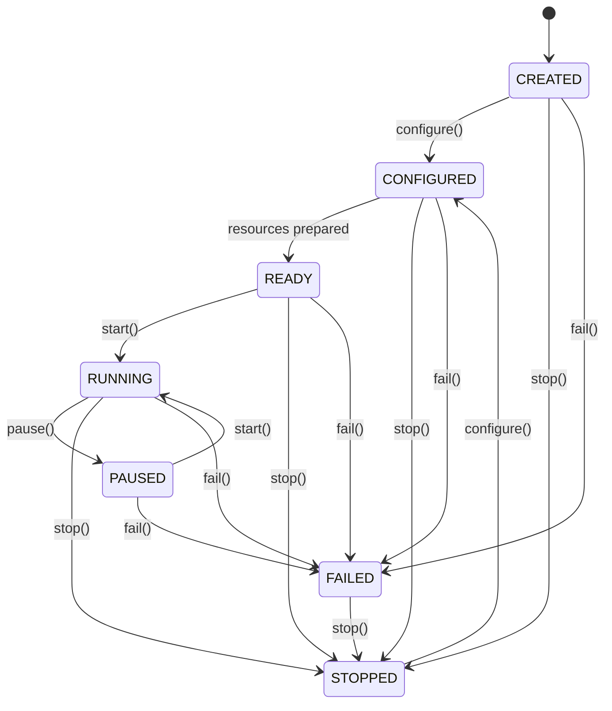
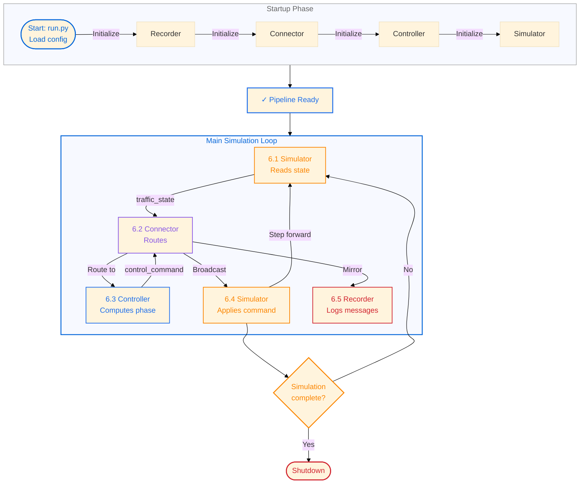

<p align="center">
  
</p>

# Traffic Control Platform

A proof-of-concept modular traffic control platform demonstrating how optimization and control modules can be composed with traffic simulators, communication systems, and data storage backends. This repository is designed as an example for signal timing optimization strategies and modular component architecture.

## Overview

The platform provides:

- **Three control strategies** for traffic signal timing: fixed-cycle, max-pressure, and priority-pass auction control
- **Modular component architecture** where optimization modules, simulators, communication systems, and storage are decoupled
- **Finite-state machine lifecycle** for all components, making composition explicit and testable
- **SUMO integration** for microscopic traffic simulation using the TraCI API
- **TCP-based inter-component communication** with JSON-line message format
- **Persistent logging** of all control decisions and simulation results

## Control Strategies

### 1. Fixed-Cycle Controller

Pre-timed signal schedules with offset coordination across intersections. Each intersection cycles through fixed phase durations regardless of traffic conditions. Simple and predictable, but cannot adapt to demand changes.

**Demo Configuration:** `configurations/demo_sumo_fixed_cycle_config.json`  
**Vienna Configuration:** `configurations/vienna_sumo_fixed_cycle_config.json`

### 2. Max-Pressure Controller

Real-time responsive control based on queue pressures (difference in queue lengths at opposite approaches). Uses an auction mechanism to assign the next green phase to the direction with highest pressure. Adapts immediately to traffic demand but may be unstable under high congestion.

**Demo Configuration:** `configurations/demo_sumo_max_pressure_config.json`  
**Vienna Configuration:** `configurations/vienna_sumo_max_pressure_config.json`

### 3. Priority-Pass Controller

Extension of max-pressure that includes priority for specific vehicles in the auction mechanism. Balances traffic efficiency with transit reliability through a configurable trade-off parameter.

**Demo Configuration:** `configurations/demo_sumo_priority_pass_config.json`  
**Vienna Configuration:** `configurations/vienna_sumo_priority_pass_config.json`

## Repository Structure

```
src/
  simulation_sumo.py           SUMO/TraCI simulator FSM component
  controller_fixed_cycle.py    Fixed-cycle controller FSM
  controller_max_pressure.py   Max-pressure auction controller FSM
  controller_priority_pass.py  Priority-pass auction controller FSM
  connector.py                 TCP JSON-line message router FSM
  recorder.py                  Communication logger FSM
  evaluator.py                 Evaluation component for travel time analysis

configurations/
  demo_sumo_fixed_cycle_config.json       Demo: fixed-cycle controller
  demo_sumo_max_pressure_config.json      Demo: max-pressure controller
  demo_sumo_priority_pass_config.json     Demo: priority-pass controller (default)
  vienna_sumo_fixed_cycle_config.json     Vienna: fixed-cycle controller
  vienna_sumo_max_pressure_config.json    Vienna: max-pressure controller
  vienna_sumo_priority_pass_config.json   Vienna: priority-pass controller

scenarios/demo/sumo/
  config.sumocfg               SUMO configuration
  network.net.xml              Network topology
  demand.xml                   Vehicle routes
  phase_*.json                 Lane-to-phase mappings
  route_*.json                 Route metadata

tests/
  test_core.py                 Component lifecycle and FSM tests
  test_priority_pass.py        Priority-pass specific tests

docs/
  STRUCTURE.md                 Directory structure and module responsibilities
  DECISIONS.md                 Architectural decision records
  INTEGRATIONS.md              External tool integration guides
  scratchpad.md                Session working notes

memory-bank/
  Persistent project context (see CLAUDE.md for guidelines)
```

## Architecture

### Component Model

The platform separates five core responsibilities:

- **Execution Layer (Simulator / Pilot)**: Execution module onto which the selected module should be applied, abstracting interfaces specific to the selected simulation / pilot city environment (e.g. SUMO or the Vienna pilot) and exposes state (queue lengths, vehicle positions)
- **Controller / Optimization Modules**: Depending on the type of module connected to the execution layer, specific simulator states are read and control outputs are generated (e.g. traffic signal timing decisions)
- **Connector**: Routes JSON-line messages between Simulator, Controller, and Recorder over TCP
- **Recorder**: Logs all inter-component communication for post-simulation analysis
- **Storage**: Persists records and logs (currently to text files; SQLite backend available)

### Finite State Machine Lifecycle

Every component is modeled as a finite state machine. This makes composition explicit and allows each component to manage its own readiness without hidden state:

- **CREATED** → **CONFIGURED** → **READY** → **RUNNING** → **PAUSED** → **RUNNING** → **STOPPED**
- **FAILED** transitions are possible from any state; **STOPPED** can reconfigure
- Components negotiate startup order through the Connector



### Control Loop

The components operate in a closed loop, applied to the example scenario of computing traffic signal timing decisions based on SUMO simulation state. The loop is as follows:

```
1. Execution layer reads SUMO state (queue lengths, vehicle positions)
2. Execution layer publishes "traffic_state" message via Connector
3. Controller receives "traffic_state", computes next signal timing
4. Controller publishes "control_command" message via Connector
5. Execution layer receives "control_command", applies it to SUMO
6. Recorder logs all messages for post-simulation analysis
7. Loop repeats at SUMO step rate (~0.1s per step)
```

All communication is JSON-line over TCP (localhost, configurable ports). Component startup and shutdown order is coordinated through explicit state transitions.

## Inter-Component Communication

Messages use a simple JSON envelope:

```json
{
  "timestamp": "2026-06-24T12:34:56Z",
  "sender": "simulator",
  "receiver": "controller",
  "topic": "traffic_state",
  "payload": {
    "step": 1234,
    "queue_lengths": {"J25": 5, "J26": 12, ...},
    "signal_state": {"J25": "green", "J26": "red", ...}
  }
}
```

Topics define the message contract (in the currently considered demonstration scenario with SUMO & traffic signal control):

- `"traffic_state"` — Simulator → Controller: queue lengths, vehicle counts, signal state
- `"control_command"` — Controller → Simulator: phase assignment, timing parameters
- `"log_message"` — Any → Recorder: diagnostic and decision logs
- `"recorder_ready"` — Recorder: startup complete, ready to receive messages

## System Flowchart

The diagram shows component startup and the steady-state control loop. The main simulation loop (steps 6.1–6.7) repeats at SUMO's step rate (~0.1s per cycle) and represents the core of the methodology:



**Core Methodology: Main Simulation Loop**

The steady-state loop repeats at ~0.1s per cycle and is the core of the control system:

1. **6.1** — Simulator reads current traffic state (queue lengths, vehicle positions)
2. **6.2–6.3** — Connector routes traffic state to Controller, which computes the optimal signal phase
3. **6.4** — Connector broadcasts control command back to Simulator
4. **6.5** — Connector mirrors messages to Recorder for logging and analysis
5. **6.6** — SUMO advances one simulation step, loop checks if simulation is complete
6. **Loop back** to 6.1 if incomplete, or **Shutdown** when done

This closed-loop control enables adaptive traffic signal optimization. The phase computation algorithm depends on the selected controller strategy: fixed-cycle timing, max-pressure auction, or priority-pass optimization.

## Running Scenarios

Each control strategy has its own configuration file. The naming convention is `{scenario}_sumo_{controller}_config.json`.

### Demo Scenario Configs

**Demo Fixed-Cycle Control:**

```bash
python run.py configurations/demo_sumo_fixed_cycle_config.json
```

**Demo Max-Pressure Control:**

```bash
python run.py configurations/demo_sumo_max_pressure_config.json
```

**Demo Priority-Pass Control (default):**

```bash
python run.py configurations/demo_sumo_priority_pass_config.json
```

Or simply:

```bash
python run.py
```

### Vienna Pilot Scenario Configs

**Vienna Fixed-Cycle Control:**

```bash
python run.py configurations/vienna_sumo_fixed_cycle_config.json
```

**Vienna Max-Pressure Control:**

```bash
python run.py configurations/vienna_sumo_max_pressure_config.json
```

**Vienna Priority-Pass Control:**

```bash
python run.py configurations/vienna_sumo_priority_pass_config.json
```

### Help and Available Scenarios

```bash
python run.py --help
```

### Output

- **Simulation logs:** `logs/{scenario}_{controller}/` — Complete trace of all decisions and state
  - Example: `logs/demo_fixed_cycle/`, `logs/vienna_priority_pass/`
- **Vehicle event log:** `logs/{scenario}_{controller}/vehicle_log.jsonl` — Vehicle arrivals and departures with priority status
- **Communication log:** `logs/{scenario}_{controller}/communication_log.txt` — All inter-component messages
- **SUMO GUI:** Visual representation of vehicles and signal states (when `sumo-gui` is available)

## Requirements

- **Python 3.13** (required)
- **SUMO 1.19.0+** (for simulation; the platform can run without it in dry-run mode)
  - Install via Homebrew on macOS: `brew install sumo`
  - Install via package manager on Linux or from [sumo.dlr.de](https://sumo.dlr.de)
  - Ensure `sumo-gui` or `sumo` binary is on PATH or set `SUMO_HOME` environment variable

## Setup

1. Clone the repository
2. Create and activate a virtual environment:
   ```bash
   python3.13 -m venv venv
   source venv/bin/activate  # on Windows: venv\Scripts\activate
   ```
3. Install dependencies:
   ```bash
   pip install -r requirements.txt
   ```
4. Run tests to verify setup:
   ```bash
   pytest tests/ -v
   ```
5. Run a scenario:
   ```bash
   python run.py configurations/demo_sumo_fixed_cycle_config.json
   ```
   Or run the default (demo priority-pass):
   ```bash
   python run.py
   ```

## Development

Update the README when making code changes. See `CLAUDE.md` and `AGENTS.md` for guidance on keeping documentation in sync with implementation.

Running the test suite:

```bash
pytest tests/ -v
```

Code quality check:

```bash
pylint src/
```
