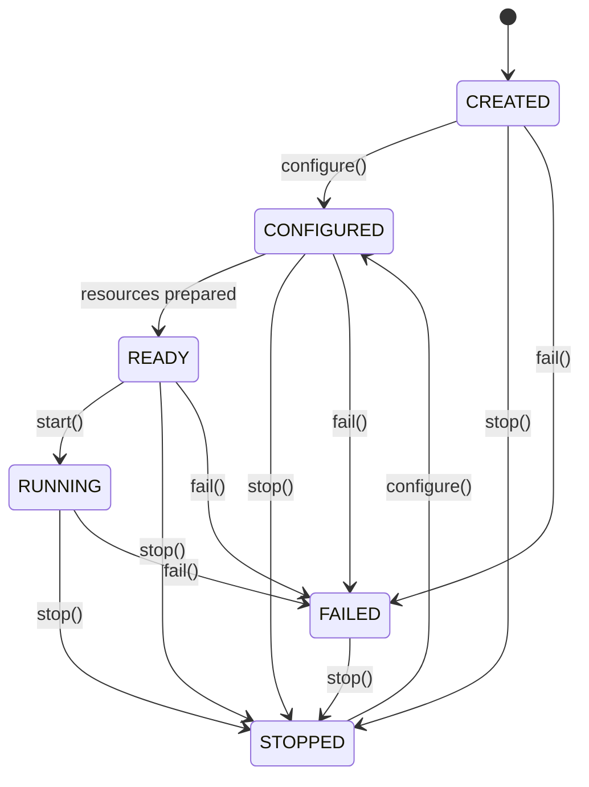
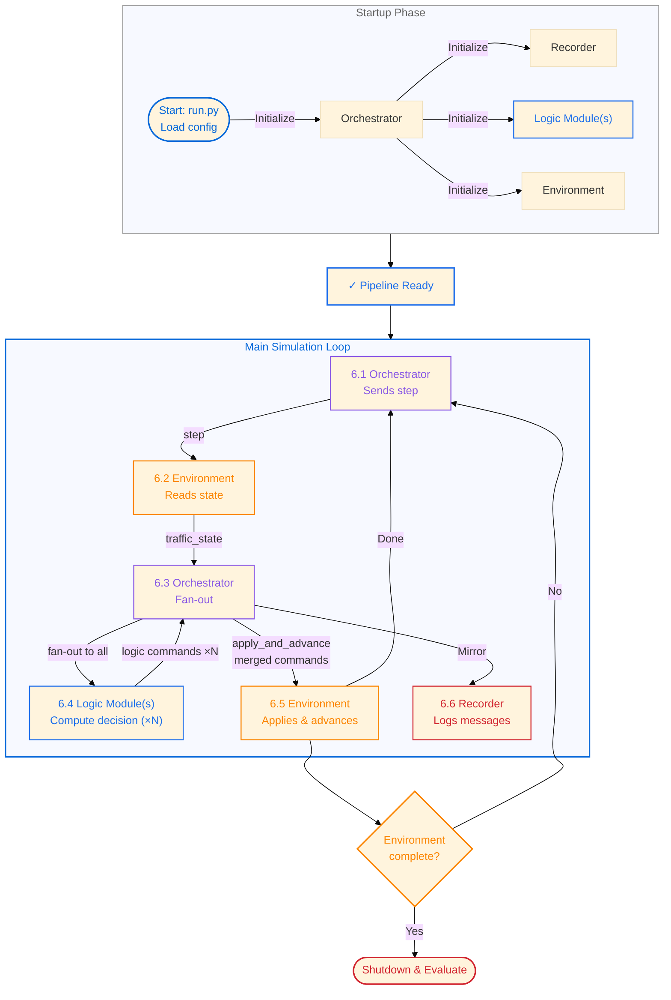

<p align="center">
  
</p>

# FEDORA — Traffic Management Orchestration Framework

**[Full documentation →](https://ivt-baug-ethz.github.io/fedora_platform/)**

A modular orchestration framework for integrating traffic logic modules (such as traffic signal controllers, demand models, etc.) with compatible simulation environments or real-world deployment sites. The framework decouples decision logic from environment execution through a JSON-line message-passing architecture over TCP: an Orchestrator routes state observations from the environment to all connected logic modules and feeds their merged decisions back to the environment each step.

**This repository demonstrates the framework** at the example of traffic signal control. Three signal controllers — Fixed-Cycle, Max-Pressure, and the custom-developed Urban Priority Pass (UPP) — are connected to SUMO (Simulation of Urban MObility) as the executing environment. The architecture is not specific to traffic signal control: any logic module that produces a compatible command in response to an environment state observation can be plugged in, and any environment that implements the `step` / `apply_and_advance` message contract can serve as the execution backend.

## Overview

The framework provides:

- **Pluggable environment slot** — any environment implementing the `step` / `apply_and_advance` message contract can be connected (event- and time-based simulations / real-world deployment sides); currently `"sumo"` (SUMO/TraCI) is supported, with the same interface covering future real-world pilot deployments
- **Pluggable logic module stack** — one or more logic modules receive environment state and produce commands each step; outputs are merged before application, enabling module composition without code changes
- **Finite-state machine lifecycle** for all components, making composition explicit and testable
- **Orchestrator-driven control loop** — sole orchestrator that creates all sub-components from configuration, communicates the requested environment state, accumulates module responses, and drives each step
- **TCP-based inter-component communication** with JSON-line message format over localhost
- **Persistent logging** of all inter-component messages for post-run analysis and evaluation

## Demonstrator: Traffic Signal Controllers

The following three logic modules implement traffic signal control strategies as demonstrators of the framework. Each module shares the same message interface — receiving `traffic_state` observations from the SUMO environment and returning `logic_command` decisions to the Orchestrator — and can be swapped or combined without changes to any other component.

### 1. Fixed-Cycle Controller

Pre-timed signal schedules with offset coordination across intersections. Each intersection cycles through fixed phase durations regardless of traffic conditions. Simple and predictable, but cannot adapt to demand changes.

**Demo Configuration:** `configurations/demo_sumo_fixed_cycle_config.json`  
**Vienna Configuration:** `configurations/vienna_sumo_fixed_cycle_config.json`

### 2. Max-Pressure Controller

Real-time responsive control based on queue pressures (difference in queue lengths at opposite approaches). Uses an auction mechanism to assign the next green phase to the direction with the highest pressure. Adapts immediately to traffic demand but may be unstable under high congestion.

**Demo Configuration:** `configurations/demo_sumo_max_pressure_config.json`  
**Vienna Configuration:** `configurations/vienna_sumo_max_pressure_config.json`

### 3. Urban Priority Pass (UPP) Controller

Custom-developed extension of Max-Pressure that incorporates priority bidding for designated vehicles (e.g. public transit, high-priority vehicles, ...) in the auction mechanism. Balances network-wide traffic efficiency with transit reliability through a configurable trade-off parameter.

**Demo Configuration:** `configurations/demo_sumo_priority_pass_config.json`  
**Vienna Configuration:** `configurations/vienna_sumo_priority_pass_config.json`

## Repository Structure

```
src/
  environment_sumo.py          SUMO/TraCI environment FSM component
  controller_fixed_cycle.py    Fixed-cycle controller FSM
  controller_max_pressure.py   Max-pressure auction controller FSM
  controller_priority_pass.py  Priority-pass auction controller FSM
  orchestrator.py              TCP JSON-line message router FSM
  recorder.py                  Communication logger FSM
  evaluator.py                 Evaluation component for travel time analysis

configurations/
  demo_sumo_fixed_cycle_config.json       Demo: fixed-cycle controller
  demo_sumo_max_pressure_config.json      Demo: max-pressure controller
  demo_sumo_priority_pass_config.json     Demo: priority-pass controller (default)
  vienna_sumo_fixed_cycle_config.json     Vienna: fixed-cycle controller
  vienna_sumo_max_pressure_config.json    Vienna: max-pressure controller
  vienna_sumo_priority_pass_config.json   Vienna: priority-pass controller

scenarios/demo/sumo/
  config.sumocfg               SUMO configuration
  network.net.xml              Network topology
  demand.xml                   Vehicle routes
  phase_*.json                 Lane-to-phase mappings
  route_*.json                 Route metadata

tests/
  test_evaluator.py            Evaluator unit tests (travel time calculation)
  test_controllers.py          Controller FSM, auction logic, and measurement requirement tests
  test_recorder.py             Recorder FSM, configuration, and TCP logging tests

.agent-docs/
  STRUCTURE.md                 Directory structure and module responsibilities
  DECISIONS.md                 Architectural decision records
  INTEGRATIONS.md              External tool integration guides
  scratchpad.md                Session working notes

docs/
  index.md                     Home page (deployed to GitHub Pages)
  getting-started.md           Setup and installation guide
  architecture.md              Architecture overview
  components.md                Component reference
  configuration.md             Configuration reference

memory-bank/
  Persistent project context (see CLAUDE.md for guidelines)
```

## Architecture

### Component Model

The framework separates five core responsibilities:

- **Environment**: The single pluggable execution backend per configuration, specified by `"type"` in the `"environment"` config section. Any environment that implements the `step` / `apply_and_advance` message contract can be connected; currently `"sumo"` (SUMO/TraCI microscopic traffic simulation) is supported, and the same interface covers future real-world pilot deployments. The environment exposes observable states (e.g. queue lengths, vehicle positions, signal states in the SUMO demonstrator) to Logic Modules via the Orchestrator.
- **Logic Modules**: One or more pluggable modules that receive environment state and produce command outputs each step. In the demonstrator these are traffic signal controllers, but any module that produces a compatible command dict can be plugged in. All modules run each step; their command dicts are merged by the Orchestrator before being sent to the environment.
- **Orchestrator**: Sole orchestrator — creates all sub-components from the configuration, drives the step loop, and routes JSON-line messages between Environment, Logic Modules, and Recorder over TCP.
- **Recorder**: Logs all inter-component communication for post-simulation analysis.
- **Storage**: Persists records and logs to text files (additional backends planned).

### Finite State Machine Lifecycle

Every component is modeled as a finite state machine. This makes composition explicit and allows each component to manage its own readiness without hidden state:

- **CREATED** → **CONFIGURED** → **READY** → **RUNNING** → **STOPPED**
- **FAILED** transitions are possible from any state; **STOPPED** can reconfigure
- Components are created and started in order by the Orchestrator



### Control Loop

The components operate in a closed loop driven by the Orchestrator:

```
1. Orchestrator sends "step" to Environment
2. Environment collects current state and publishes "traffic_state"
3. Orchestrator fans "traffic_state" out to all Logic Modules simultaneously
4. Each Logic Module computes its decision and publishes a "logic_command"
5. Orchestrator accumulates responses; once all modules have replied, merges commands and sends "apply_and_advance" to Environment
6. Environment applies the merged commands and advances one step
7. Recorder logs all messages for post-simulation analysis
8. Loop repeats at the environment's step rate (e.g. ~0.1s per step for SUMO)
```

All communication is JSON-line over TCP (localhost, configurable ports). Component startup and shutdown order is coordinated through explicit state transitions.

## Inter-Component Communication

Messages use a simple JSON envelope:

```json
{
  "sent_at": 1750000000.0,
  "sender": "environment",
  "target": "logic_module",
  "topic": "traffic_state",
  "payload": {
    "step": 1234,
    "queue_lengths": {"J25": 5, "J26": 12, ...},
    "signal_state": {"J25": "green", "J26": "red", ...}
  }
}
```

Topics define the message contract:

- `"traffic_state"` — Environment → Logic Module(s) (via Orchestrator fan-out): current environment state observations (e.g. queue lengths, vehicle counts, signal state in the SUMO traffic scenario)
- `"logic_command"` — Logic Module(s) → Orchestrator: decision output from a logic module; payload includes a `"type"` field (e.g. `"traffic_light_command"`) identifying the command kind; one response per module per step
- `"step"` — Orchestrator → Environment: begin next state-collection iteration
- `"apply_and_advance"` — Orchestrator → Environment: apply the merged logic commands and advance the environment by one step
- `"environment_started"` / `"environment_stopped"` — Environment → Orchestrator: lifecycle signals
- `"communication"` — Orchestrator → Recorder: mirror of all routed messages

## System Flowchart

The diagram shows component startup and the steady-state control loop. The main loop (steps 6.1–6.6) repeats at the environment's step rate and represents the core of the methodology:



**Core Methodology: Main Simulation Loop**

The steady-state loop repeats at the environment's step rate (e.g. ~0.1s per cycle for SUMO) and is the core of the control system:

1. **6.1** — Orchestrator sends a `step` command to the Environment to begin a new iteration
2. **6.2–6.3** — Environment collects current state and publishes `traffic_state`; Orchestrator fans it out to all configured Logic Modules simultaneously
3. **6.4** — Each Logic Module independently computes its decision and publishes a `logic_command` response (N responses total for N modules)
4. **6.5** — Orchestrator accumulates responses; once all N modules have replied, it merges their command dicts and sends a single `apply_and_advance` to the Environment, which applies the merged commands and advances one step
5. **6.6** — Orchestrator mirrors all messages to Recorder for logging and analysis
6. **Loop back** to 6.1 if incomplete, or **Shutdown and evaluate** when done

This closed-loop architecture enables any logic module to make adaptive decisions against any compatible environment. A single logic module runs per step by default; multiple modules can be stacked by listing them in the `"logic_modules"` array in the configuration. Each module's computation is independent — the Orchestrator merges all command dicts and issues a single `apply_and_advance` once every module has responded.

## Running Scenarios

Each control strategy has its own configuration file. The naming convention is `{scenario}_sumo_{logic_module}_config.json`.

### Demo Scenario Configs

**Demo Fixed-Cycle Control:**

```bash
python run.py configurations/demo_sumo_fixed_cycle_config.json
```

**Demo Max-Pressure Control:**

```bash
python run.py configurations/demo_sumo_max_pressure_config.json
```

**Demo Priority-Pass Control (default):**

```bash
python run.py configurations/demo_sumo_priority_pass_config.json
```

Or simply:

```bash
python run.py
```

### Vienna Pilot Scenario Configs

**Vienna Fixed-Cycle Control:**

```bash
python run.py configurations/vienna_sumo_fixed_cycle_config.json
```

**Vienna Max-Pressure Control:**

```bash
python run.py configurations/vienna_sumo_max_pressure_config.json
```

**Vienna Priority-Pass Control:**

```bash
python run.py configurations/vienna_sumo_priority_pass_config.json
```

### Help and Available Scenarios

```bash
python run.py --help
```

### Output

- **Simulation logs:** `logs/{scenario}_{logic_module}/` — Set per configuration file (`recorder.logs_dir`)
  - `vehicle_log.jsonl` — Vehicle arrivals and departures with priority status
  - `communication_log.txt` — All inter-component messages
  - Example: `logs/demo_fixed_cycle/`, `logs/vienna_priority_pass/`
- **Evaluation results:** `results/{scenario}/{logic_module}/` — Generated automatically after each run
  - `travel_time_distribution.png` — Histogram of regular and priority vehicle travel times
  - `average_travel_time.png` — Cumulative average travel time over simulation time
  - `vehicle_counts.png` — Total vehicle count over simulation time
  - `evaluation_stats.json` — Summary statistics (mean, median, min/max travel times)
  - Example: `results/demo/fixed_cycle/`, `results/vienna/priority_pass/`
- **SUMO GUI:** Visual representation of vehicles and signal states (when `sumo-gui` is available)

Pass `--skip-evaluation` to suppress post-run evaluation and visualization:

```bash
python run.py configurations/demo_sumo_fixed_cycle_config.json --skip-evaluation
```

## Requirements

- **Python 3.13** (required)
- **SUMO 1.19.0+** (for simulation; the platform can run without it in dry-run mode)
  - Install via Homebrew on macOS: `brew install sumo`
  - Install via package manager on Linux or from [sumo.dlr.de](https://sumo.dlr.de)
  - Ensure `sumo-gui` or `sumo` binary is on PATH or set `SUMO_HOME` environment variable

## Setup

1. Clone the repository
2. Create and activate a virtual environment:
   ```bash
   python3.13 -m venv venv
   source venv/bin/activate  # on Windows: venv\Scripts\activate
   ```
3. Install dependencies:
   ```bash
   pip install -r requirements.txt
   ```
4. Run tests to verify setup:
   ```bash
   pytest tests/ -v
   ```
5. Run a scenario:
   ```bash
   python run.py configurations/demo_sumo_fixed_cycle_config.json
   ```
   Or run the default (demo priority-pass):
   ```bash
   python run.py
   ```

## Documentation

Full user-facing documentation — setup guide, architecture overview, component reference, and configuration reference — is available at:

**[https://ivt-baug-ethz.github.io/fedora_platform/](https://ivt-baug-ethz.github.io/fedora_platform/)**

The documentation source lives in `docs/` and is automatically deployed to GitHub Pages on every push to `main`.

## Development

Update the README when making code changes. See `CLAUDE.md` and `AGENTS.md` for guidance on keeping documentation in sync with implementation.

Running the test suite:

```bash
pytest tests/ -v
```

Code quality check:

```bash
pylint src/
```
