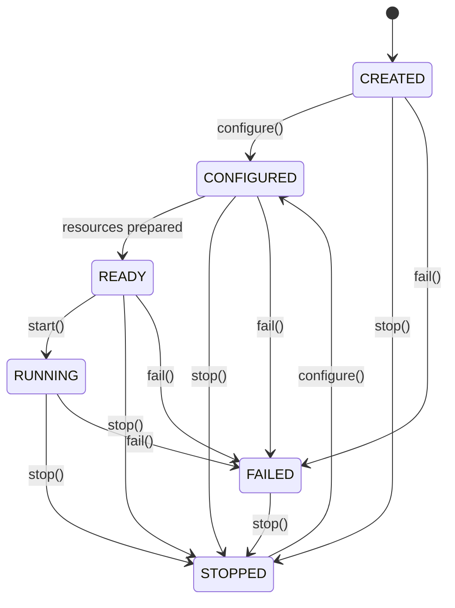
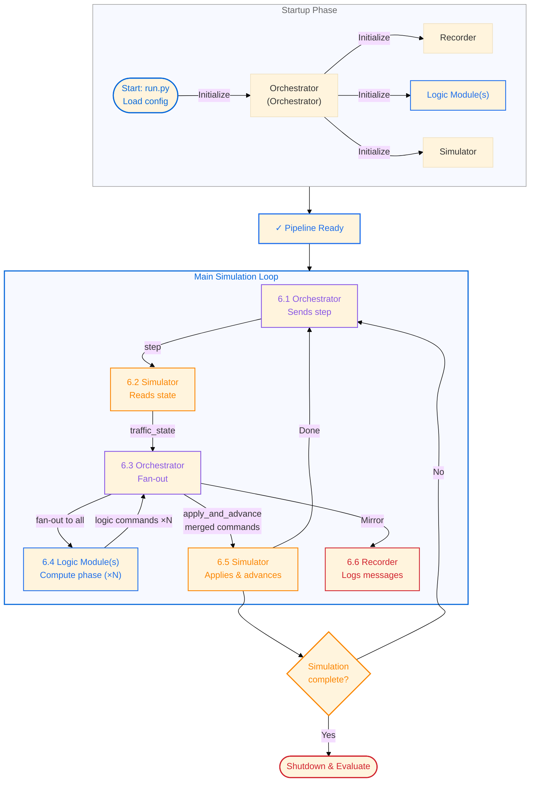

<p align="center">
  
</p>

# Traffic Control Platform

A proof-of-concept modular traffic control platform demonstrating how optimization and control modules can be composed with traffic simulators, communication systems, and data storage backends. This repository is designed as an example for signal timing optimization strategies and modular component architecture.

## Overview

The platform provides:

- **Three control strategies** for traffic signal timing: fixed-cycle, max-pressure, and priority-pass auction control
- **Modular component architecture** where optimization modules, simulators, communication systems, and storage are decoupled
- **Finite-state machine lifecycle** for all components, making composition explicit and testable
- **SUMO integration** for microscopic traffic simulation using the TraCI API
- **TCP-based inter-component communication** with JSON-line message format
- **Persistent logging** of all control decisions and simulation results

## Control Strategies

### 1. Fixed-Cycle Controller

Pre-timed signal schedules with offset coordination across intersections. Each intersection cycles through fixed phase durations regardless of traffic conditions. Simple and predictable, but cannot adapt to demand changes.

**Demo Configuration:** `configurations/demo_sumo_fixed_cycle_config.json`  
**Vienna Configuration:** `configurations/vienna_sumo_fixed_cycle_config.json`

### 2. Max-Pressure Controller

Real-time responsive control based on queue pressures (difference in queue lengths at opposite approaches). Uses an auction mechanism to assign the next green phase to the direction with highest pressure. Adapts immediately to traffic demand but may be unstable under high congestion.

**Demo Configuration:** `configurations/demo_sumo_max_pressure_config.json`  
**Vienna Configuration:** `configurations/vienna_sumo_max_pressure_config.json`

### 3. Priority-Pass Controller

Extension of max-pressure that includes priority for specific vehicles in the auction mechanism. Balances traffic efficiency with transit reliability through a configurable trade-off parameter.

**Demo Configuration:** `configurations/demo_sumo_priority_pass_config.json`  
**Vienna Configuration:** `configurations/vienna_sumo_priority_pass_config.json`

## Repository Structure

```
src/
  simulation_sumo.py           SUMO/TraCI simulator FSM component
  controller_fixed_cycle.py    Fixed-cycle controller FSM
  controller_max_pressure.py   Max-pressure auction controller FSM
  controller_priority_pass.py  Priority-pass auction controller FSM
  orchestrator.py                 TCP JSON-line message router FSM
  recorder.py                  Communication logger FSM
  evaluator.py                 Evaluation component for travel time analysis

configurations/
  demo_sumo_fixed_cycle_config.json       Demo: fixed-cycle controller
  demo_sumo_max_pressure_config.json      Demo: max-pressure controller
  demo_sumo_priority_pass_config.json     Demo: priority-pass controller (default)
  vienna_sumo_fixed_cycle_config.json     Vienna: fixed-cycle controller
  vienna_sumo_max_pressure_config.json    Vienna: max-pressure controller
  vienna_sumo_priority_pass_config.json   Vienna: priority-pass controller

scenarios/demo/sumo/
  config.sumocfg               SUMO configuration
  network.net.xml              Network topology
  demand.xml                   Vehicle routes
  phase_*.json                 Lane-to-phase mappings
  route_*.json                 Route metadata

tests/
  test_evaluator.py            Evaluator unit tests (travel time calculation)
  test_controllers.py          Controller FSM, auction logic, and measurement requirement tests
  test_recorder.py             Recorder FSM, configuration, and TCP logging tests

docs/
  STRUCTURE.md                 Directory structure and module responsibilities
  DECISIONS.md                 Architectural decision records
  INTEGRATIONS.md              External tool integration guides
  scratchpad.md                Session working notes

memory-bank/
  Persistent project context (see CLAUDE.md for guidelines)
```

## Architecture

### Component Model

The platform separates five core responsibilities:

- **Execution Layer (Simulator / Pilot)**: Execution module onto which the selected module should be applied, abstracting interfaces specific to the selected simulation / pilot city environment (e.g. SUMO or the Vienna pilot) and exposes state (queue lengths, vehicle positions)
- **Logic Modules**: One or more pluggable modules receive the simulation state and generate control outputs (e.g. traffic signal timing decisions). All modules run each step; their command dicts are merged before being applied
- **Orchestrator**: Sole orchestrator — creates all sub-components, drives the simulation step loop, and routes JSON-line messages between Simulator, Logic Modules, and Recorder over TCP
- **Recorder**: Logs all inter-component communication for post-simulation analysis
- **Storage**: Persists records and logs to text files (additional backends planned)

### Finite State Machine Lifecycle

Every component is modeled as a finite state machine. This makes composition explicit and allows each component to manage its own readiness without hidden state:

- **CREATED** → **CONFIGURED** → **READY** → **RUNNING** → **STOPPED**
- **FAILED** transitions are possible from any state; **STOPPED** can reconfigure
- Components are created and started in order by the Orchestrator



### Control Loop

The components operate in a closed loop, applied to the example scenario of computing traffic signal timing decisions based on SUMO simulation state. The Orchestrator actively orchestrates each iteration:

```
1. Orchestrator sends "step" to Simulation
2. Simulation reads SUMO state (queue lengths, vehicle positions), publishes "traffic_state"
3. Orchestrator fans "traffic_state" out to all Logic Modules simultaneously
4. Each Logic Module computes its signal timing decision and publishes "traffic_light_command"
5. Orchestrator accumulates responses; once all modules have replied, merges commands and sends "apply_and_advance" to Simulation
6. Simulation applies the merged signal plan and advances one SUMO step
7. Recorder logs all messages for post-simulation analysis
8. Loop repeats at SUMO step rate (~0.1s per step)
```

All communication is JSON-line over TCP (localhost, configurable ports). Component startup and shutdown order is coordinated through explicit state transitions.

## Inter-Component Communication

Messages use a simple JSON envelope:

```json
{
  "sent_at": 1750000000.0,
  "sender": "simulation",
  "target": "logic_module",
  "topic": "traffic_state",
  "payload": {
    "step": 1234,
    "queue_lengths": {"J25": 5, "J26": 12, ...},
    "signal_state": {"J25": "green", "J26": "red", ...}
  }
}
```

Topics define the message contract (in the currently considered demonstration scenario with SUMO & traffic signal control):

- `"traffic_state"` — Simulation → Logic Module(s) (via Orchestrator fan-out): queue lengths, vehicle counts, signal state
- `"traffic_light_command"` — Logic Module(s) → Orchestrator: signal phase assignment and timing; one response per module per step
- `"step"` — Orchestrator → Simulation: begin next measurement-collect iteration
- `"apply_and_advance"` — Orchestrator → Simulation: apply signal plan and advance one SUMO step
- `"simulation_started"` / `"simulation_stopped"` — Simulation → Orchestrator: lifecycle signals
- `"communication"` — Orchestrator → Recorder: mirror of all routed messages

## System Flowchart

The diagram shows component startup and the steady-state control loop. The main simulation loop (steps 6.1–6.6) repeats at SUMO's step rate (~0.1s per cycle) and represents the core of the methodology:



**Core Methodology: Main Simulation Loop**

The steady-state loop repeats at ~0.1s per cycle and is the core of the control system:

1. **6.1** — Orchestrator sends a `step` command to the Simulator to begin a new iteration
2. **6.2–6.3** — Simulator reads current SUMO state and publishes `traffic_state`; Orchestrator fans it out to all configured Logic Modules simultaneously
3. **6.4** — Each Logic Module independently computes its signal phase decision and publishes a `traffic_light_command` response (N responses total for N modules)
4. **6.5** — Orchestrator accumulates responses; once all N modules have replied, it merges their command dicts and sends a single `apply_and_advance` to the Simulator, which applies the merged plan and advances one SUMO step
5. **6.6** — Orchestrator mirrors all messages to Recorder for logging and analysis
6. **Loop back** to 6.1 if incomplete, or **Shutdown and evaluate** when done

This closed-loop control enables adaptive traffic signal optimization. A single logic module runs per step by default; multiple modules can be stacked by listing them in the `"logic_modules"` array in the configuration. Each module's phase computation is independent — the merged command dict is sent as a single `apply_and_advance` after all modules respond.

## Running Scenarios

Each control strategy has its own configuration file. The naming convention is `{scenario}_sumo_{logic_module}_config.json`.

### Demo Scenario Configs

**Demo Fixed-Cycle Control:**

```bash
python run.py configurations/demo_sumo_fixed_cycle_config.json
```

**Demo Max-Pressure Control:**

```bash
python run.py configurations/demo_sumo_max_pressure_config.json
```

**Demo Priority-Pass Control (default):**

```bash
python run.py configurations/demo_sumo_priority_pass_config.json
```

Or simply:

```bash
python run.py
```

### Vienna Pilot Scenario Configs

**Vienna Fixed-Cycle Control:**

```bash
python run.py configurations/vienna_sumo_fixed_cycle_config.json
```

**Vienna Max-Pressure Control:**

```bash
python run.py configurations/vienna_sumo_max_pressure_config.json
```

**Vienna Priority-Pass Control:**

```bash
python run.py configurations/vienna_sumo_priority_pass_config.json
```

### Help and Available Scenarios

```bash
python run.py --help
```

### Output

- **Simulation logs:** `logs/{scenario}_{logic_module}/` — Set per configuration file (`recorder.logs_dir`)
  - `vehicle_log.jsonl` — Vehicle arrivals and departures with priority status
  - `communication_log.txt` — All inter-component messages
  - Example: `logs/demo_fixed_cycle/`, `logs/vienna_priority_pass/`
- **Evaluation results:** `results/{scenario}/{logic_module}/` — Generated automatically after each run
  - `travel_time_distribution.png` — Histogram of regular and priority vehicle travel times
  - `average_travel_time.png` — Cumulative average travel time over simulation time
  - `evaluation_stats.json` — Summary statistics (mean, median, min/max travel times)
  - Example: `results/demo/fixed_cycle/`, `results/vienna/priority_pass/`
- **SUMO GUI:** Visual representation of vehicles and signal states (when `sumo-gui` is available)

Pass `--skip-evaluation` to suppress post-run evaluation and visualization:

```bash
python run.py configurations/demo_sumo_fixed_cycle_config.json --skip-evaluation
```

## Requirements

- **Python 3.13** (required)
- **SUMO 1.19.0+** (for simulation; the platform can run without it in dry-run mode)
  - Install via Homebrew on macOS: `brew install sumo`
  - Install via package manager on Linux or from [sumo.dlr.de](https://sumo.dlr.de)
  - Ensure `sumo-gui` or `sumo` binary is on PATH or set `SUMO_HOME` environment variable

## Setup

1. Clone the repository
2. Create and activate a virtual environment:
   ```bash
   python3.13 -m venv venv
   source venv/bin/activate  # on Windows: venv\Scripts\activate
   ```
3. Install dependencies:
   ```bash
   pip install -r requirements.txt
   ```
4. Run tests to verify setup:
   ```bash
   pytest tests/ -v
   ```
5. Run a scenario:
   ```bash
   python run.py configurations/demo_sumo_fixed_cycle_config.json
   ```
   Or run the default (demo priority-pass):
   ```bash
   python run.py
   ```

## Development

Update the README when making code changes. See `CLAUDE.md` and `AGENTS.md` for guidance on keeping documentation in sync with implementation.

Running the test suite:

```bash
pytest tests/ -v
```

Code quality check:

```bash
pylint src/
```
