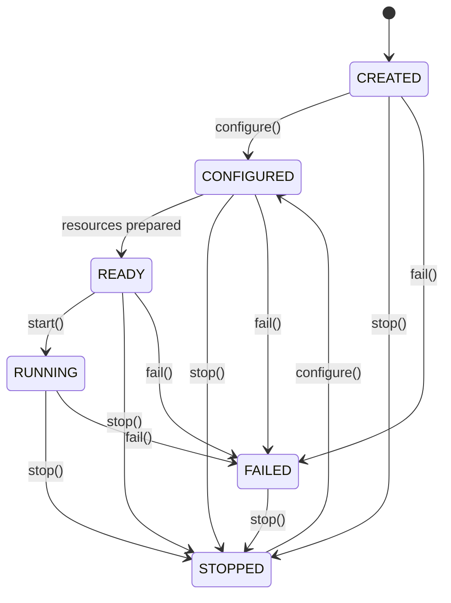
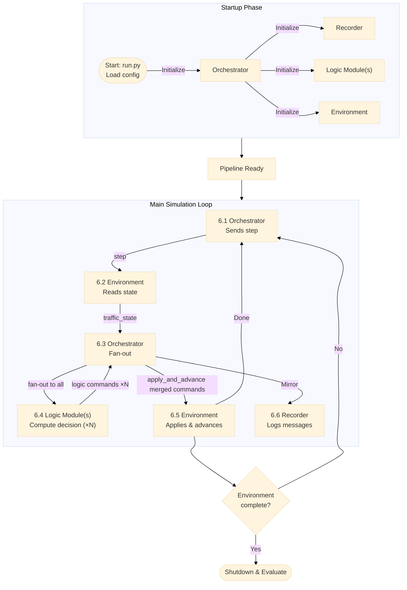

# Architecture

## Overview

FEDORA separates five core responsibilities across independent components connected by a TCP message bus:

| Component | Role |
|---|---|
| **Environment** | Execution backend (simulation or real deployment) |
| **Logic Module(s)** | Decision-making (one or more, pluggable) |
| **Orchestrator** | Sole controller — creates all sub-components, drives the step loop |
| **Recorder** | Logs all inter-component messages |
| **Storage** | Persists records to files or databases |

## Component Lifecycle (FSM)

Every component is modelled as a finite-state machine. This makes composition explicit and ensures each component manages its own readiness without hidden state.

```
CREATED → CONFIGURED → READY → RUNNING → STOPPED
```

`FAILED` transitions are reachable from any state. `STOPPED` can reconfigure.



## Control Loop

The Orchestrator drives a closed loop at the environment's step rate (e.g. ~0.1 s/step for SUMO):



### Step-by-Step

1. Orchestrator sends `step` to Environment → begin new iteration
2. Environment collects current state and publishes `traffic_state`
3. Orchestrator fans `traffic_state` out to all configured Logic Modules simultaneously
4. Each Logic Module independently computes its decision and publishes a `logic_command`
5. Orchestrator accumulates N responses; merges their command dicts; sends single `apply_and_advance` to Environment
6. Environment applies merged commands and advances one step
7. Orchestrator mirrors all messages to Recorder
8. Loop back to step 1, or shut down when the environment signals completion

## Message Format

All messages use a JSON-line envelope over TCP:

```json
{
  "sent_at": 1750000000.0,
  "sender": "environment",
  "target": "logic_module",
  "topic": "traffic_state",
  "payload": {
    "step": 1234,
    "queue_lengths": {"J25": 5, "J26": 12},
    "signal_state": {"J25": "green", "J26": "red"}
  }
}
```

### Message Topics

| Topic | Direction | Description |
|---|---|---|
| `traffic_state` | Environment → Logic Module(s) via Orchestrator | Current environment state observations |
| `logic_command` | Logic Module → Orchestrator | Decision output; `payload.type` identifies command kind |
| `step` | Orchestrator → Environment | Begin next state-collection iteration |
| `apply_and_advance` | Orchestrator → Environment | Apply merged commands and advance one step |
| `get_state` | Orchestrator → Environment / Logic Module(s) | Request a snapshot of internal state (sent when state polling is active) |
| `state_report` | Environment / Logic Module(s) → Orchestrator | Response to `get_state`; contains only the fields enabled in `state_polling` config |
| `environment_started` / `environment_stopped` | Environment → Orchestrator | Lifecycle signals |
| `communication` | Orchestrator → Recorder | Mirror of all routed messages (including `state_report` responses) |

## Communication Layer

All communication is JSON-line over persistent TCP connections on localhost. Default port assignments:

| Component | Default address |
|---|---|
| Orchestrator | `127.0.0.1:51000` |
| Environment (SUMO) | `127.0.0.1:51001` |
| Logic Module | `127.0.0.1:51002` |
| Recorder | `127.0.0.1:51003` |

Connections are persistent (one socket per target, reused for all messages). Receivers parse line-by-line; each newline-terminated JSON string is one message.
